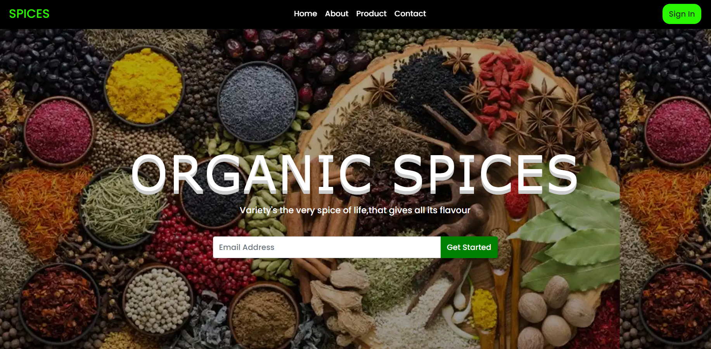
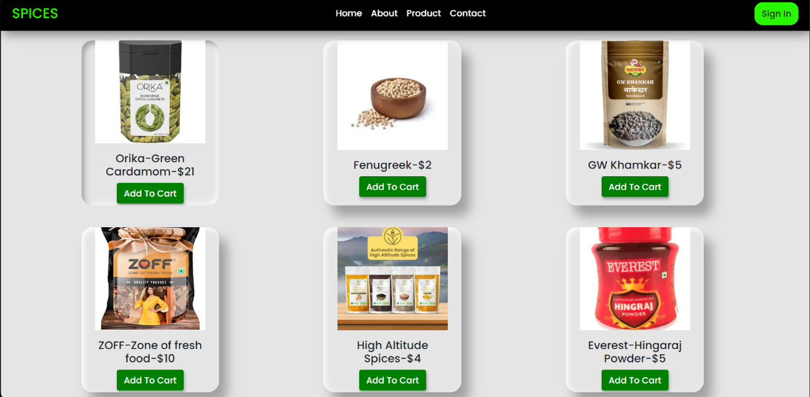
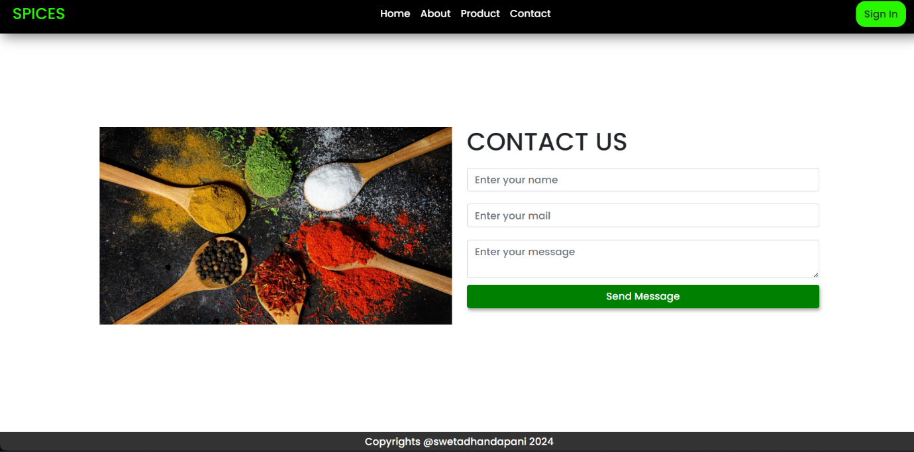

The **Responsive E-commerce Website** project demonstrates the creation
of a fully responsive and visually appealing e-commerce platform using
**HTML**, **CSS**, and **Bootstrap**. It caters to Tamil-speaking
learners, providing a step-by-step guide for designing a website with
modern features, all while focusing on accessibility and responsiveness
for various devices.

**Project Overview**

The project aims to build a professional and user-friendly e-commerce
website. Using **Bootstrap**, it ensures that the design adapts
seamlessly to different screen sizes, including desktops, tablets, and
smartphones. The project focuses on the front-end design without backend
integration.

**Key Features**

**1. Home Page**

-   **Featured Products**:

    -   A responsive product showcase with cards displaying images,
        names, prices, and ratings.

-   **Footer**:

    -   Contact information, quick links, and social media integration.

**2. Product Page**

-   **Product Listings**:

    -   Display of multiple products in a grid or list format.

    -   Sorting and filtering options (price, category, ratings, etc.).

-   **Responsive Cards**:

    -   Each card includes product images, names, prices, \"Add to
        Cart\" buttons, and ratings.

**3. Product Details Page**

-   Detailed information about a selected product:

    -   High-quality images (carousel or zoom feature).

    -   Name, price, description, and specifications.

    -   Add-to-cart and buy-now buttons.

**4. Shopping Cart**

-   **Cart Summary**:

    -   A responsive table listing added products, quantities, and
        prices.

    -   Options to update or remove items.

**5. Responsive Design**

-   Leveraging Bootstrap\'s grid system and components to ensure:

    -   Proper alignment and scaling of content on all devices.

    -   Smooth navigation and usability.

**6. Navigation Bar**

-   Sticky navbar with links to key sections (Home, Categories, Cart,
    etc.).

-   Dropdowns for subcategories or user profiles.

-   Search bar for finding products quickly.

**7. Footer**

-   Contains essential links, company information, and social media
    handles.

> 

**Technologies Used**

-   **HTML**: Provides the structure and content of the website.

-   **CSS**: Customizes styling, colors, and layout.

-   **Bootstrap**: Enhances responsiveness and includes prebuilt
    components like buttons, navbars, cards, carousels, and grids.

**Implementation Details**

**1. Bootstrap Grid System**

-   Used for responsive layout design (e.g., col-md-4, col-sm-6 for
    product grids).

**2. Navigation Bar**

-   Created using Bootstrap\'s navbar component with dropdowns and a
    search bar.

**3. Carousel**

-   Used for showcasing featured products or banners in a rotating
    slider format.

**4. Cards**

-   Product details are displayed using Bootstrap\'s card component with
    an image, title, and button.

**5. Forms**

-   Contact forms and user input fields for the checkout page designed
    using Bootstrap form components.

**6. Utility Classes**

-   Bootstrap\'s utility classes for spacing, alignment, text styling,
    and responsive visibility (d-flex, p-3, text-center, etc.).

**Advantages of Using Bootstrap**

1.  **Prebuilt Components**: Saves time with ready-to-use elements.

2.  **Responsive Design**: Automatically adapts to different screen
    sizes.

3.  **Consistency**: Ensures a uniform look across browsers.

4.  **Ease of Customization**: Modify themes and components as needed.

**Future Enhancements**

1.  **Backend Integration**: Add a backend using Node.js, PHP, or Django
    for user authentication and database handling.

2.  **Dynamic Content**: Fetch product details dynamically using APIs or
    databases.

3.  **Payment Gateway**: Implement secure payment methods.

4.  **Admin Panel**: Add an admin panel for product management.

This project provides a solid foundation for creating e-commerce
websites. It is an excellent starting point for learners to understand
responsive design and Bootstrap's potential, paving the way for
full-fledged e-commerce solutions.
